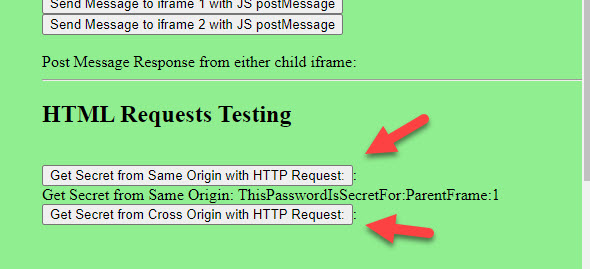
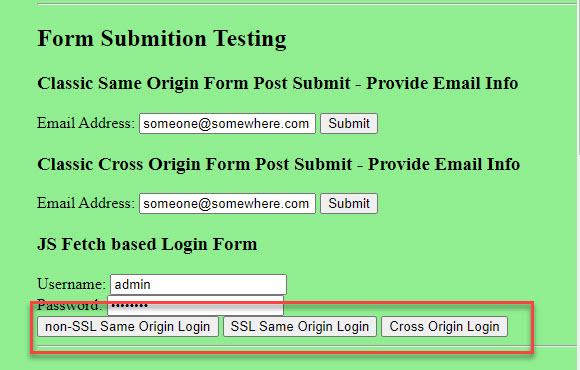
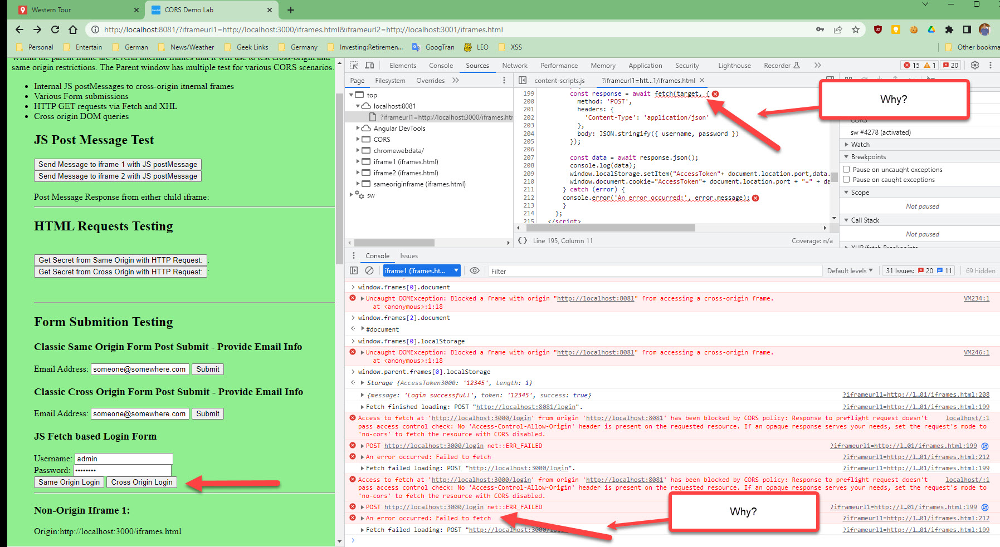

<!-- vscode-markdown-toc -->

- 1. [Background](#Background)
  - 1.1. [Lesson 1: Where does Origin Come From?](#Lesson1:WheredoesOriginComeFrom)
  - 1.2. [Lesson 2: Site vs Origin..](#Lesson2:SitevsOrigin..)
- 2. [Lab Overview](#LabOverview)
- 3. [Installation](#Installation)
- 4. [Usage](#Usage)
  - 4.1. [Use Browser Debugger to inspect CORS traffic](#UseBrowserDebuggertoinspectCORStraffic)
  - 4.2. [Start Program](#StartProgram)
  - 4.3. [Cross-Origin Queries](#Cross-OriginQueries)
    - 4.3.1. [JS fetch](#JSfetch)
    - 4.3.2. [Forms](#Forms)
    - 4.3.3. [PostMessage](#PostMessage)
    - 4.3.4. [Cross Origin DOM access](#CrossOriginDOMaccess)
    - 4.3.5. [LocalStorage](#LocalStorage)
    - 4.3.6. [getElementByTagName()](#getElementByTagName)
    - 4.3.7. [Forms](#Forms-1)
    - 4.3.8. [PostMessage](#PostMessage-1)
    - 4.3.9. [X-Frame Options](#X-FrameOptions)
    - 4.3.10. [JS fetch](#JSfetch-1)
- 5. [FAQ](#FAQ)
  - 5.1. [Go did not install](#Godidnotinstall)
  - 5.2. [Could not execute hello world](#Couldnotexecutehelloworld)
  - 5.3. [Could not execute startlab.sh in unix](#Couldnotexecutestartlab.shinunix)
  - 5.4. [Web Servers did not all startup](#WebServersdidnotallstartup)
  - 5.5. [Localhost webpage did not load](#Localhostwebpagedidnotload)

<!-- vscode-markdown-toc-config
	numbering=true
	autoSave=true
	/vscode-markdown-toc-config -->
<!-- /vscode-markdown-toc -->

# CORS Demo Lab

TBD-

- cookies
- read only response
- send credentials

## 1. <a name='Background'></a>Background

One of the elements missing when watching YouTube videos explaining technology, is the hands on experience
to explore the "What Ifs" along with seeing both sides of the client-server interaction on a step-by-step
basis. This is the only way to fully understand how a technology works.

[Same-Origin-Policy SOP](https://developer.mozilla.org/en-US/docs/Web/Security/Same-origin_policy) states that in a browser, the document or script from one origin cannot data (e.g. cookies, storage, DOM) in a different different origin.

[Cross-Origin-Requests CORS](https://www.w3.org/TR/2020/SPSD-cors-20200602/) is a way of permitting cross origin access for HTTP requests (vs but does NOT regulate internal JavaScript(JS) access, no impact, still follows SOP). CORS also controls how credentials are sent across orgin in order to ensure the evil target origin does not steal the good guys bank origin credentials.

SOP and CORS are easy to understand at a high
level, but once one reads all the rules behind it, becomes very complex . There are a lot of "Rule XXX is always true EXCEPT in these cases" (localStorage vs cookies, img vs GET response, JS internal data vs HTTP data, \* vs nil, one one domain allowed per Allow-Origin in some browsers, Forms not subject to CORS). One can understand that as a developer working in a 2-week sprint, one would just throw up their hands and find the easiest way to bypass all these restrictions because it is too complex to try and understand them.

So in order to explore the intracies of CORS "What-Ifs", I created a Golang based CORS lab. Developers can use this lab to better understand the "What-Ifs"of CORS, and hopefully work within its limitations vs coding around them.

### 1.1. <a name='Lesson1:WheredoesOriginComeFrom'></a>Lesson 1: Where does Origin Come From?

When a browser/render loads a page from a website, the browser tags that page with a Origin attribute in the DOM. This attribute is used to determine which windows/frames can see what data.


### 1.2. <a name='Lesson2:SitevsOrigin..'></a>Lesson 2: Site vs Origin..

Same Origin Policy states that JavaScript cannot access data across Origins. What is an Origin?
An origin is very strict, the whole url domain from 'h' to portnumber will make a match. Subdomains are not in the same Origin.
Site is more flexible, subdomains are in the same Site. These are used in cookie restrictions.


So for SOP, scripts in evil.com inside a web page cannot access the cookies of good.com.  
CORS is a method of allowing that interaction to happen with limitations.


## 2. <a name='LabOverview'></a>Lab Overview

This CORS security lab allows users to explore both the client and server
side of CORS. Users can manipulate both the Client JavaScript and Server GO HTTP header CORS
attributes and view what the results are.

This is done thru the use of a main program and two iframes, all in different origins via
unique port numbers. The main program is a web server that forks to sub-processes all with
different port numbers which makes the document.location.origin unique.


Users can then switch between the 3 JS contexts (main, iframe1, iframe2) and view how CORS impacts accessing data
from the different origins. Users can do this with:

- localStorage - Can one access local storage between origins?
- getElementById() to retrieve DOM data between origins and see response
- cookies - can one see cookies between origins?
- Forms - Post login and try to view response
- postMessage between iframes to retrieve data
- JS fetch - can one fetch/HTTP GET and view response between origins

## 3. <a name='Installation'></a>Installation

<hr>
 
 Create a golang HELLO WORLD project in order to install Golang

1. https://go.dev/doc/tutorial/getting-started
2. Here is download: https://go.dev/doc/install
3. Restart window to pick up ENV $PATH for go.exe
4. Make sure the Hello World is working in go

<hr>
 Install CORS lab

1. cd ..
2. git clone https://github.com/dreezman/CORS-Demo-Lab.git
3. cd CORS-Demo-Lab

<hr>

```
############## Start Backend Web Servers ################
#####    Unix
chmod +x startlab.sh
./startlab.sh
# to kill all background jobs
killall main

#####   Windows PowerShell
set-executionpolicy unrestricted -scope process
.\startlab.ps1
# to kill all background jobs
get-job| stop-job | remove-job
```

## 4. <a name='Usage'></a>Usage

### 4.1. <a name='UseBrowserDebuggertoinspectCORStraffic'></a>Use Browser Debugger to inspect CORS traffic

We will use the browser debugger/Inspector a lot to examine the code and traffic between the client and browser.

- Chrome: Press F12 in Chrome or
- FireFox: 3-bars-MoreTools-WebDeveloperTools
  to begin inspection.

### 4.2. <a name='StartProgram'></a>Start Program

Wait for program to start, takes 30 seconds, then browse to main web server it will load the HTML into all the 3 web servers from each
or their respective origins.

```
http://localhost:9081/?iframeurl1=http://localhost:3000/iframes.html&iframeurl2=http://localhost:3001/iframes.html
```

You can see pages loaded in their respective origins.


Now press on the "Send Message" buttons to send messages postMessages between the
iframes and the parent, all in different origins.

Use Chrome Inspector or Firefox Debugger, to monitor the network traffic and inspect the header fields for the CORS headers.


The default is to allow all cross-origin requests via "Access-Control-Allow-Origin: \*"

You can then modify the [main.go](./main.go) program to change HTTP header fields and watch the CORS errors occur in the console.

```
const addOriginHeader = true // add Access-Control header to HTTP response
var AllowOrigin string = "*" // Choose a Access-Control origin header
//var AllowOrigin string = "http://localhost:9081"
//var AllowOrigin string = "http://localhost:3000"
//var AllowOrigin string = "http://localhost:3001"
//var AllowOrigin string = "http://localhost:222"
```

<hr>

Also test the login sequence with user: admin password: password and view the post and response. Note the response token is stored in the localStorage.


### 4.3. <a name='Cross-OriginQueries'></a>Cross-Origin Queries

Now we will manually to cross-Origin queries by manually executing JavaScript commands.

In the Inspector console, one can switch between JavaScript contexts to execute JavaScript commands in the local context.


For reference;

The parent window has 5 sub-frames, each can be indexed to view their DOMs...if you know how to work withing the bounds of SOP.

- window.iframe[0] = iframe1 = http://localhost:3000
- window.iframe[1] = iframe2 = http://localhost:3001
- window.iframe[2] = parent = http://localhost:9081
- window.iframe[3] = w3.org = https://www.w3.org
- window.iframe[4] = google = https://www.google.com

Bring up the console in all the tabs...


Use the Inspector Console to manually do queries between the 3 origins to see if you can read the responses to the queries.

#### 4.3.1. <a name='JSfetch'></a>JS fetch

Try these and see if they work with both

- var AllowOrigin string = "http://localhost:222"
- var AllowOrigin string = \*



Why is it working/not working?

#### 4.3.2. <a name='Forms'></a>Forms

Forms are a bit special with CORS. There are two types of forms according to CORS.

- Simple Classic Forms: The browser POSTs some data but no JS exists to process the response
- JS Forms: The form is processed by JS for both the POST and the response



Try all the different logins and watch the network traffic and see how the CORS headers are exchanged. Try submitting these with both

- var AllowOrigin string = "http://localhost:222"
- var AllowOrigin string = \*

and see what happens. Why do the classics always work but the JS sometimes fail?
Why is JS not able to read the response from a cross origin request?



#### 4.3.3. <a name='PostMessage'></a>PostMessage

Postmessage is an internal JS messaging protocol that does NOT use HTTP requests. See what happens when you send postMessages to other frames.

- Send postMessages from parent to child frames
- Send postMessages from child to parent frames


Now modify the allow-origin: [somerandomport] and see what happens.

```
// From iframes do this
window.parent.frames[0].postMessage(localStorage.userpass,'*')
window.parent.frames[1].postMessage(localStorage.userpass,'*')
window.parent.postMessage(localStorage.userpass,'*')

// Look what post message does with
http://localhost:3000
http://localhost:9081
http://localhost:3001


```

#### 4.3.4. <a name='CrossOriginDOMaccess'></a>Cross Origin DOM access

Try reading the DOMs of other iframes and see what happens.

Does "Allow-Origin: \*" have any impact?<br>
HINT: Do you see any HTML queries being executed?

Why is it working not working?<br>
HINT: Look at your Source and Target Origins (How to do this?), are they different?

```
//  From Parent: Try to access across origin to get to DOM
window.frames[0].document
//  From Parent:Try to access same origin to get to DOM
window.frames[2].document
window.frames[2].document.defaultView.localStorage
window.frames[2].parent.localStorage
// Try from current origin - Get all the internal JS
document.getElementsByTagName('script')
```

#### 4.3.5. <a name='LocalStorage'></a>LocalStorage

Try reading local storage to/from different origins to see if you can access local storage.

```
// From Parent to Iframes
window.frames[0].localStorage
window.frames[1].localStorage
// From Iframes to each other
window.parent.frames[0].localStorage
window.parent.frames[1].localStorage
// From Iframes to parent
window.parent.localStorage
```

Why is it working/not working?

#### 4.3.6. <a name='getElementByTagName'></a>getElementByTagName()

```
// Try from parent
window.frames[0]
window.frames[0].document
// Try from current origin
document.getElementsByTagName('script')
// Try from non-parent
window.parent.frames[0]
window.parent.document.getElementsByTagName('p')
```

Why is it working/not working?

TBD - Work In Progress

--- First make sure you login with user:admin and password: password <br>
--- This will load the cookies and localStorage with an AccessToken

```
// From Parent
document.cookie
// From Subframe
document.cookie
// Go to Inspector Application tab
Set Access token to None and Secure Flag
```


```
// Repeat: From Parent
document.cookie
// From Subframe
document.cookie
```

Why is it working/not working?

#### 4.3.7. <a name='Forms-1'></a>Forms

Forms are a bit special with CORS. There are two types of forms according to CORS.

- Simple Classic Forms: The browser POSTs some data but no JS exists to process the response
- JS Forms: The form is processed by JS for both the POST and the response


Try submitting these with both allow-origin:\* and allow-origin: [some-random-port] and see what happens. Why do the classics always work but the JS sometimes fail?

#### 4.3.8. <a name='PostMessage-1'></a>PostMessage

Postmessage is an internal JS messaging protocol that does NOT use HTTP requests. See what happens when you send postMessages to other frames.

- Send postMessages from parent to child frames
- Send postMessages from child to parent frames


Now modify the allow-origin: [somerandomport] and see what happens.

```
// From iframes do this
window.parent.frames[0].postMessage(localStorage.userpass,'*')
window.parent.frames[1].postMessage(localStorage.userpass,'*')
window.parent.postMessage(localStorage.userpass,'*')

// Look what post message does with
http://localhost:3000
http://localhost:9081
http://localhost:3001

// In frame1 do this
monitorEvents(window, 'message')

// In frame2 do this to frame1
window.parent.frames[0].postMessage('hixxxxx','*')
// Look at data
```

#### 4.3.9. <a name='X-FrameOptions'></a>X-Frame Options

Look up the term [X-Frame-Options](https://developer.mozilla.org/en-US/docs/Web/HTTP/Headers/X-Frame-Options?retiredLocale=de) (yes CSP obsoletes this)

1. Clear network traffic from network tab
2. Refresh the page
3. Search for google.com in the filter
4. Look at Responses
5. Look at X-Frame-Options
6. What do you think that means? Why isn't page showing?
7. Clear filter
8. Search for w3c
9. Look for X-Frame-Options
10. What do you think that means? Why is page showing?

#### 4.3.10. <a name='JSfetch-1'></a>JS fetch

```
--- Run Queries from Parent
response=await fetch("http://localhost:9081/get-json"); await response.text()
response=await fetch("http://localhost:3000/get-json"); await response.text()
```


Now modify the AllowOrigin in the [main.go](./main.go)to some foriegn domain and save file

```
//var AllowOrigin string = "*" // Choose a Access-Control origin header
//var AllowOrigin string = "http://localhost:9081"
//var AllowOrigin string = "http://localhost:3000"
//var AllowOrigin string = "http://localhost:3001"
var AllowOrigin string = "http://localhost:222"
```

Stop and Start go modules from command line

```
get-job| stop-job | remove-job ; go run main.go TLD 9081 & go run main.go iframe1 3000 & go run main.go iframe2 3001 &
```

```
--- Re-Run Queries from Parent
response=await fetch("http://localhost:9081/get-json"); await response.text()
response=await fetch("http://localhost:3000/get-json"); await response.text()
```

Why is it working/not working?

<hr>

Video coming soon...

## 5. <a name='FAQ'></a>FAQ

### 5.1. <a name='Godidnotinstall'></a>Go did not install

    	○ Resolve: Reboot IDE to pick up ENV variable
    	○ Resolve: reboot
    	○ Resolve: Only install per user not per computer
    	○ Resolve: need admin access?

### 5.2. <a name='Couldnotexecutehelloworld'></a>Could not execute hello world

    	○ Resolve: Did not put a period .  at end of go run .

### 5.3. <a name='Couldnotexecutestartlab.shinunix'></a>Could not execute startlab.sh in unix

    	○ Resolve: chmod +x startlab.sh

### 5.4. <a name='WebServersdidnotallstartup'></a>Web Servers did not all startup

- Resolve: Make sure all jobs are running
  - Powershell: get-job
    
  - Unix: jobs
    If not all running then there is a network port conflict or you started the script 2x and network ports are not available. See [Pages Not Loading](#Localhostwebpagedidnotload)

### 5.5. <a name='Localhostwebpagedidnotload'></a>Localhost webpage did not load

    	○ Resolve: Check for port collisions
    		$ netstat -an | more
    			□ Are you using these ports?
    			□ 9081
    			□ 8381  : SSL
    			□ 3000
    			□ 3300 : SSL
    			□ 3001
    			□ 3301 : SSL

      Might have to customize you startup ports in startup.ps1. You can use ports up to 65535. So maybe 10000 range??. Check your netstat | more and find free port space

      ○ Resolve: Restart IDE
      ○ Resolve: Wait 20 seconds for program to start

# Change History

- Michael Endrizzi - Author - June 2023 - Security Architect/Training/Shift Left Advocate
-

# Contributing

Pull requests are welcome. For major changes, please open an issue first
to discuss what you would like to change.

Please make sure to update tests as appropriate.

# License

- [MIT](https://choosealicense.com/licenses/mit/)
- [GO](https://go.dev/LICENSE)
